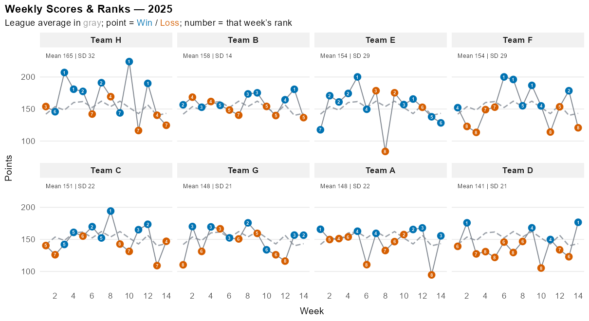
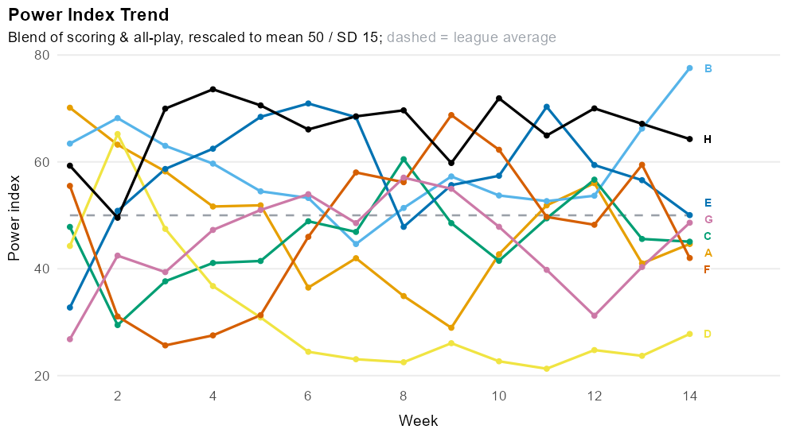
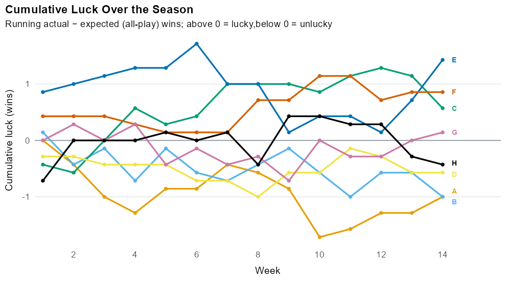
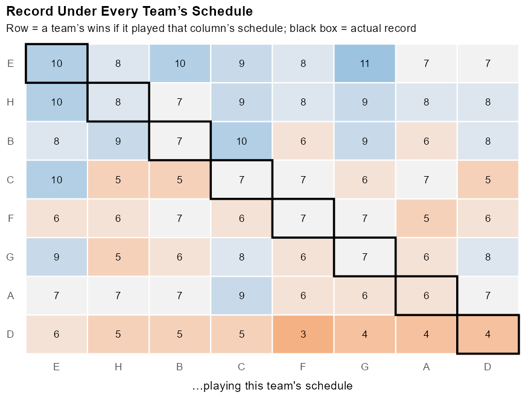
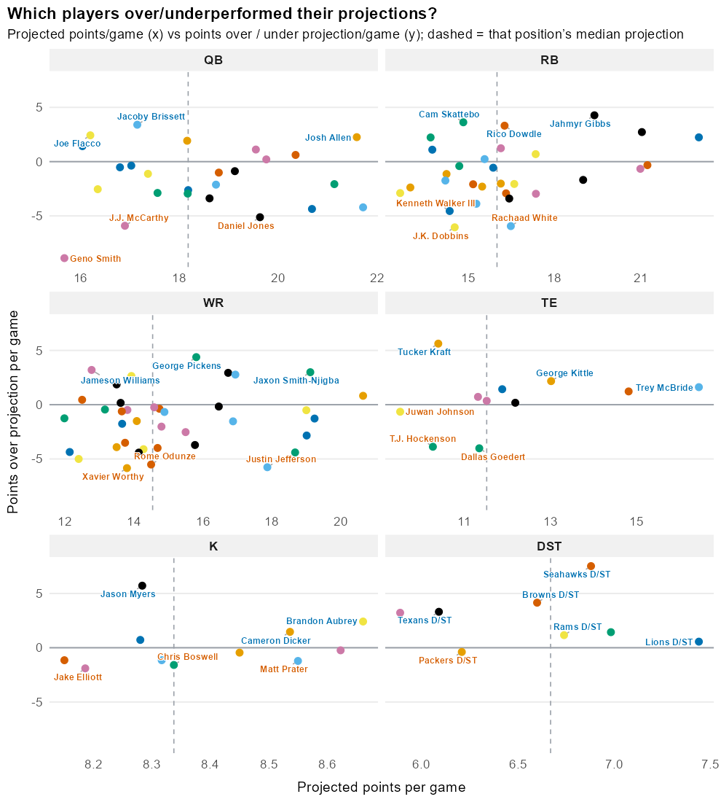
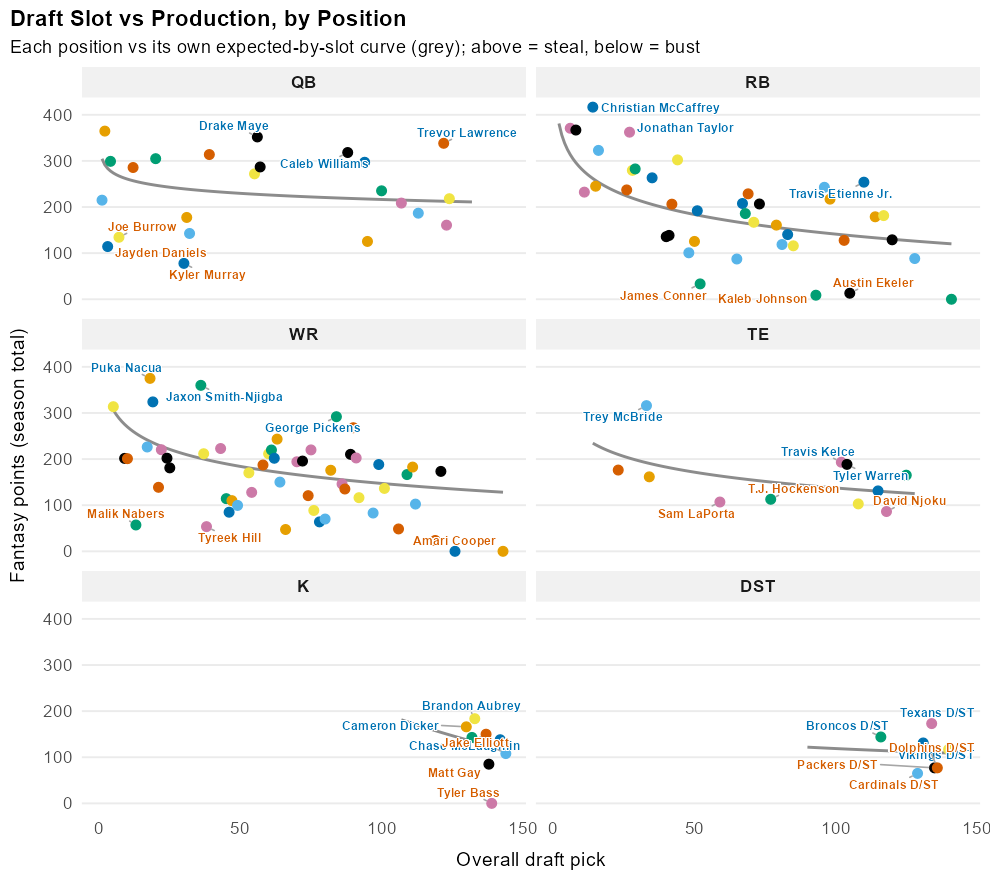
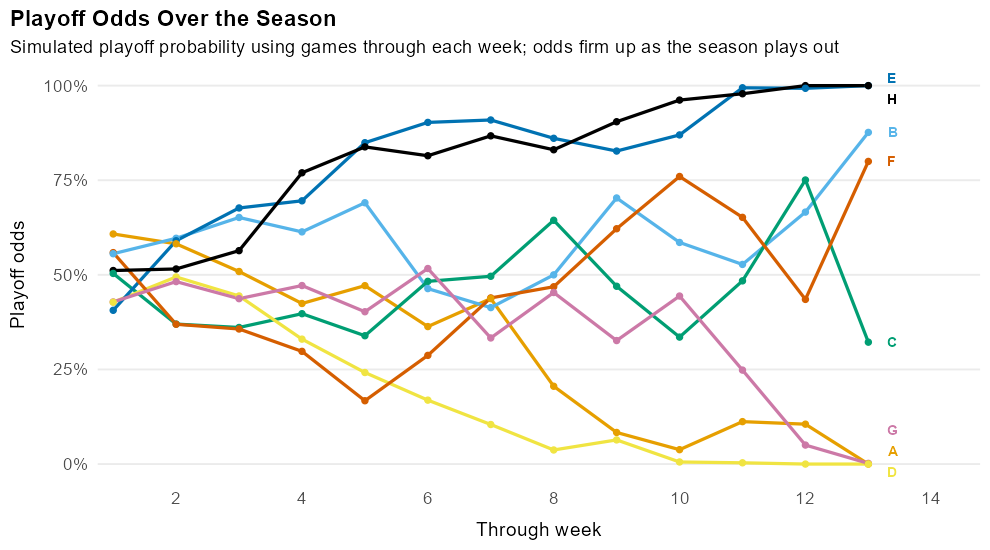

# Fantasy Football Analytics Dashboard

An interactive **R / Shiny** dashboard analyzing a real 8-team, 2-QB ESPN fantasy
football league across three seasons (2023–2025). Every figure is interactive and
every metric comes from a documented, reproducible pipeline — hover, click, and
filter down to any team, player, or week.

🔗 **Live app:** https://joseph-n-deweese.shinyapps.io/fantasy-football-analytics-public/
📊 **Data dictionary:** [data-dictionary.md](data-dictionary.md)



---

## What it does

A `bslib` navbar app with a shared colorblind-safe (Okabe-Ito) team palette —
stable per team across seasons, so each team keeps its color year to year — a
global season selector, and eight views. Interactive figures use **ggiraph**
(hover tooltips, click/search highlighting); tables use **DT**; plots auto-match
the theme via **thematic**.

| View | Question it answers |
|---|---|
| **Overview** | How is every team scoring, and where do they stand? (standings table with live playoff odds, weekly scores & ranks small-multiples) |
| **Power Rankings** | How has team strength evolved week to week? (recency-weighted blend of scoring + all-play, with an interactive rank bump + trend view) |
| **In-Season Performance › Player Scoring vs Projection** | Which players over/under-perform, and how consistently? (per-position quadrant scatter + click-to-drill-down weekly game log) |
| **In-Season Performance › All-Play & Luck** | Who's actually good vs. who's been lucky? (all-play & vs-median records, cumulative luck, schedule swap, close games) |
| **In-Season Performance › Lineup Efficiency** | How well does each team set its lineup? (efficiency %, points left on the bench, weekly lines) |
| **In-Season Performance › Team Scoring vs Projection** | Who beats their projection week to week? (faceted points-over-projected bars) |
| **Draft Analysis** | Which picks paid off — fairly across positions? (draft slot vs production, position-specific expected curve, steals/busts, team ROI) |
| **Playoff Projections** | What are each team's playoff odds? (player-level Monte Carlo with estimation uncertainty) |

### A few highlights

**A weekly power ranking** — a recency-weighted blend of scoring and all-play win%,
z-scored and rescaled to a mean-50 / SD-15 index, tracked week by week with each
team's line directly labeled:



**All-play records strip out schedule luck** — comparing every team to every other
team each week shows true strength vs. actual record. Cumulative luck tracks how
each team's wins drifted above or below that all-play expectation:



**Schedule swap** — each team's record had it played every other team's schedule
(diagonal = actual record), exposing who was helped or hurt by their slate:



**Expectation vs delivery, by position** — each player's projected points vs how
much they beat or missed that projection, faceted by position so different scoring
scales don't mislead. Click any point to drill into that player's week-by-week log:



**Position-fair draft grading** — each pick's production vs what its draft *slot*
typically returns *for its position* (so a 2-QB league's QBs don't all look like
steals); above the curve = steal, below = bust:



**Player-level Monte Carlo playoff odds** — each remaining week, every team's score
is the sum of bootstrap draws from its recent starters' game logs (shrunk toward
their projections), and each simulated season also draws a per-team **strength
offset** representing uncertainty in early-season team strength. The schedule is replayed
10,000×/week, seeded by the league tiebreak; the sims are **precomputed offline** so
the tab loads instantly.



---

## Architecture

```
app.R                    # bslib page_navbar; the Shiny app (reads data-public/)
R/
  theme_ff.R             # Okabe-Ito palette (stable by team), shared theme, ggiraph wrapper
  utils_data.R           # load cleaned data + season/week helpers
  utils_metrics.R        # all-play, luck, power, lineup efficiency, player & draft value
  utils_sim.R            # player-level Monte Carlo playoff simulation
  mod_*.R                # one Shiny module per view
data-raw/                # data pipeline (NOT used at runtime)
  01_pull_espn.R         # live ffscrapr/ESPN pull (creds from .Renviron); uses espn_compat.R
  02_load_cache.R        # offline fallback: the cached snapshot
  03_clean.R             # transform the raw pull into tidy tables
  04_playoff_sims.R      # precompute the playoff-odds simulation
  05_make_public_data.R  # anonymize team names -> data-public/*.rds
  franchise_alias.csv    # team -> "Team A", "Team B", … alias crosswalk (no real names)
data-public/             # anonymized, committed .rds — the app's data source
tools/make_figures.R     # regenerate the README figures
```

**The pipeline is separate from the app.** `data-raw/` scripts pull and clean the
data into tidy `.rds` files (and precompute the playoff sims); the app reads only
the committed `data-public/` tables. This keeps the app fast and lets it run for
anyone without API credentials.

## Run it locally

The committed `data-public/*.rds` are all the app needs, so you can launch straight
away:

```r
R -e "shiny::runApp()"
```

To refresh the data from source, add ESPN credentials to `.Renviron` (see
`.Renviron.example`) and run the pipeline in order (the raw snapshot it reads is
git-ignored because it contains ESPN owner GUIDs):

```r
Rscript data-raw/01_pull_espn.R          # live ESPN pull (compat shim applied)
Rscript data-raw/03_clean.R              # clean the raw pull into tidy tables
Rscript data-raw/04_playoff_sims.R       # precompute the playoff-odds simulation
Rscript data-raw/05_make_public_data.R   # anonymize -> data-public/ (the committed data)
```

Dependencies are pinned with `renv` (`renv::restore()` to reproduce the library).
Requires R ≥ 4.5.

## Methodology notes

- **All-play / expected wins:** each team-week is scored against every other team
  that week; season all-play win% × games = expected wins. Actual − expected =
  schedule luck.
- **Power ranking:** each week, recency-weighted scoring and all-play win% (EWMA,
  tunable half-life) are z-scored across the league and blended (tunable scoring
  weight), then rescaled to a mean-50 / SD-15 index.
- **Lineup efficiency:** actual starting points vs. the optimal lineup that could
  have been started from the roster (greedy fill of 2QB / 2RB / 3WR / 1TE / 1FLEX /
  DST / K).
- **Player scoring vs projection:** per-game points over projection, with a
  consistency read (typical p25–p75 range, SD, CV) in the click-through game log.
- **Draft value:** production = each player's season point total; the expected-by-
  slot baseline is fit **per position** (log-linear, pooled across seasons), so
  value-over-expected is fair across positions. Same baseline every year.
- **Playoff simulation:** player-level bootstrap of each team's recent starters'
  weekly scores (positional pooling for low-sample players, shrunk toward
  projections), **plus** a per-season team-strength offset (posterior-predictive
  estimation uncertainty) that fades as games accumulate, replaying the remaining
  schedule for 10,000 simulated seasons. Deterministic (seeded) and precomputed.

## ESPN API compatibility

`ffscrapr 1.4.8` no longer works against ESPN's current API out of the box: ESPN
moved authenticated reads to `lm-api-reads.fantasy.espn.com` and replaced per-team
`location`/`nickname` with a single `name` field. `data-raw/espn_compat.R` shims
both — it rewrites the host at ffscrapr's single low-level fetcher and restores team
names from the `mTeam` endpoint — so the live pull works again (verified pulling all
three seasons through the latest completed week).

## Known limitations

- **Regular-season focus:** league-performance metrics default to regular-season
  weeks, so the playoffs (incl. the ESPN-merged championship week) don't distort
  them, while week-range controls still let you focus on any span. A dedicated
  playoff view is a planned addition.

## Data privacy

Team names are **anonymized** throughout — every team appears as an anonymous label
("Team A", "Team B", …) — to respect the privacy of the real league members. Each
label is **stable across seasons**, so a team keeps the same identity even in a
season where its manager renamed it, and the analysis reads consistently year to
year. The swap is display-name-only, keyed on a stable team id
(`data-raw/franchise_alias.csv`, which itself holds no real names), so every metric,
join, and color is unaffected.

No secrets or personal identifiers are committed. ESPN credentials live in a
git-ignored `.Renviron` (see [.Renviron.example](.Renviron.example)) and are only
needed to refresh the data. The raw API snapshot — which contains ESPN owner GUIDs
— is git-ignored and never committed; those identifiers are used nowhere in the app
or the anonymization.

---

_Built with R, Shiny, bslib, ggplot2, ggiraph, DT, and ffscrapr._
